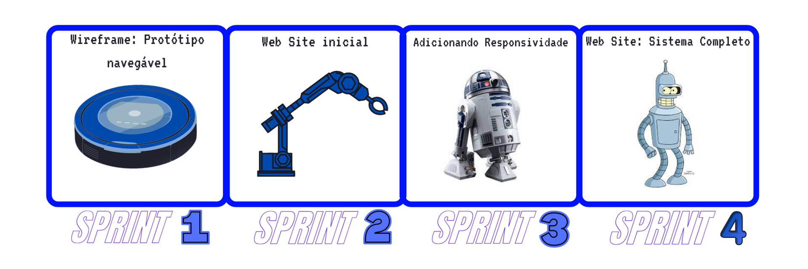
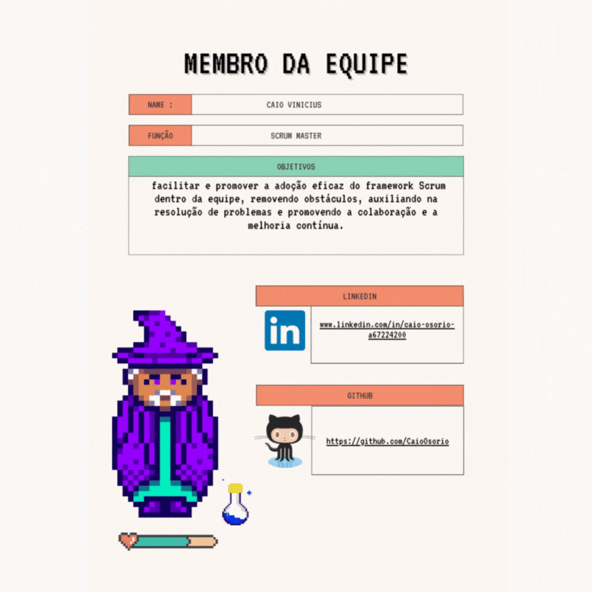
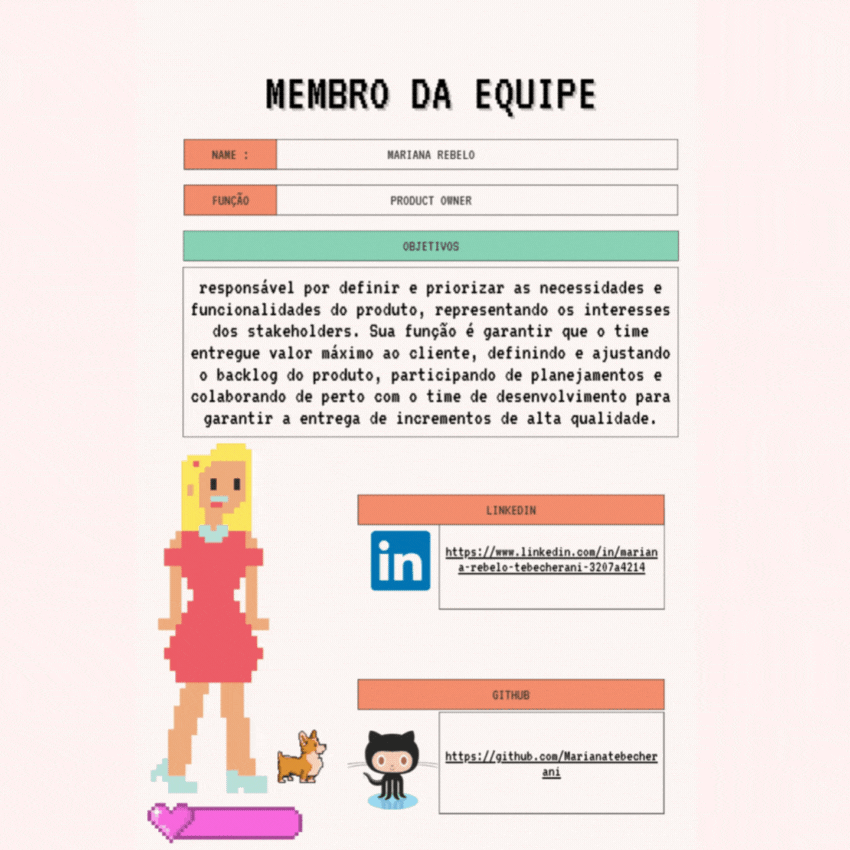
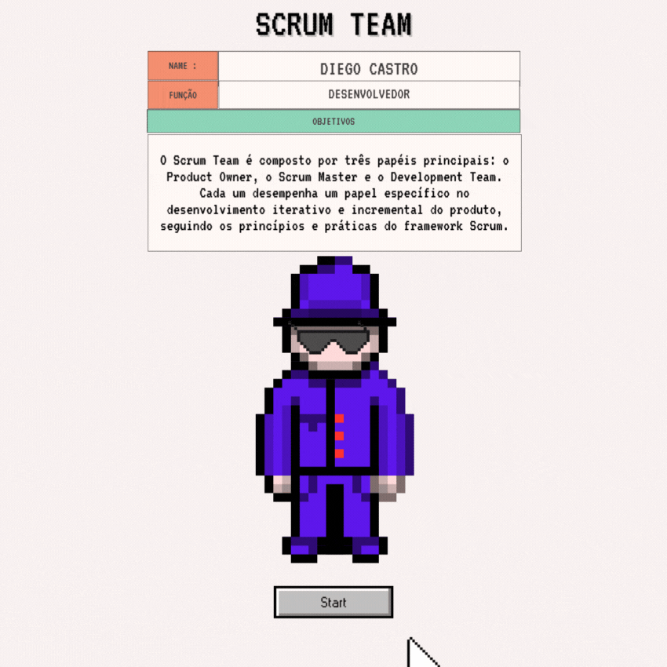
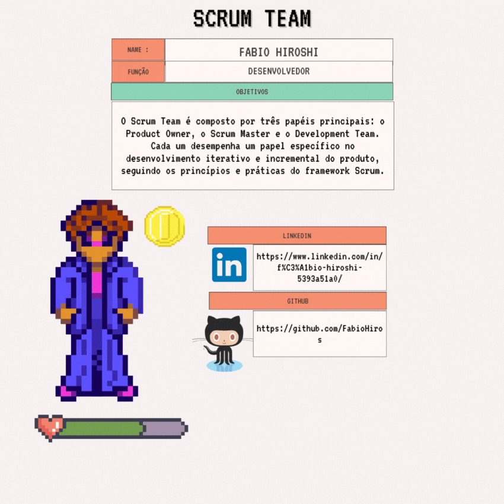
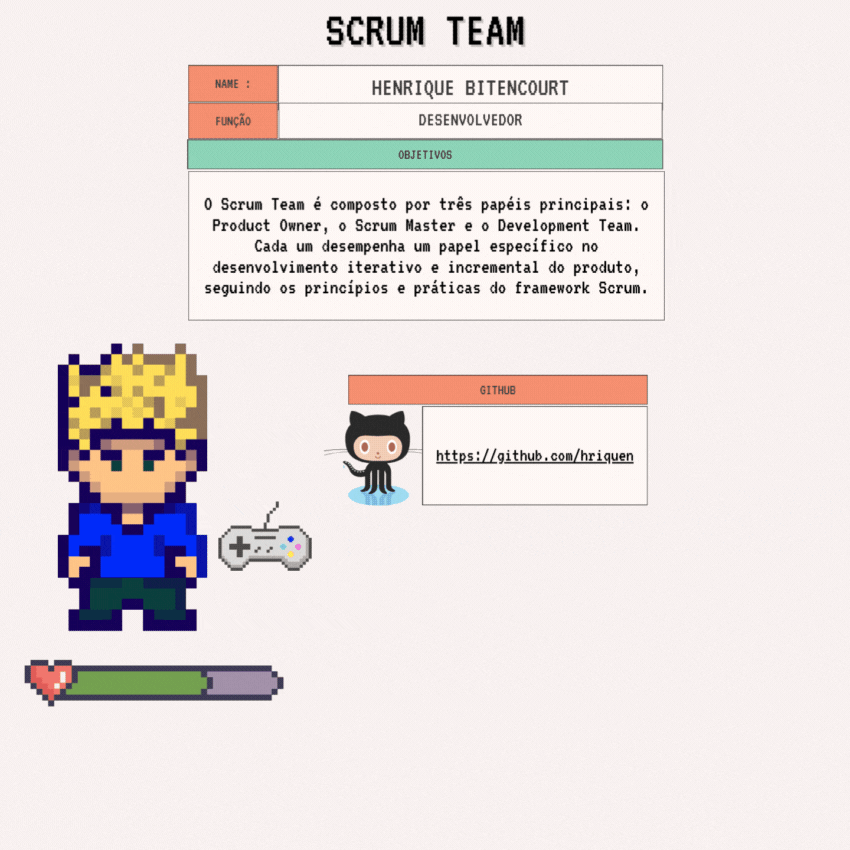
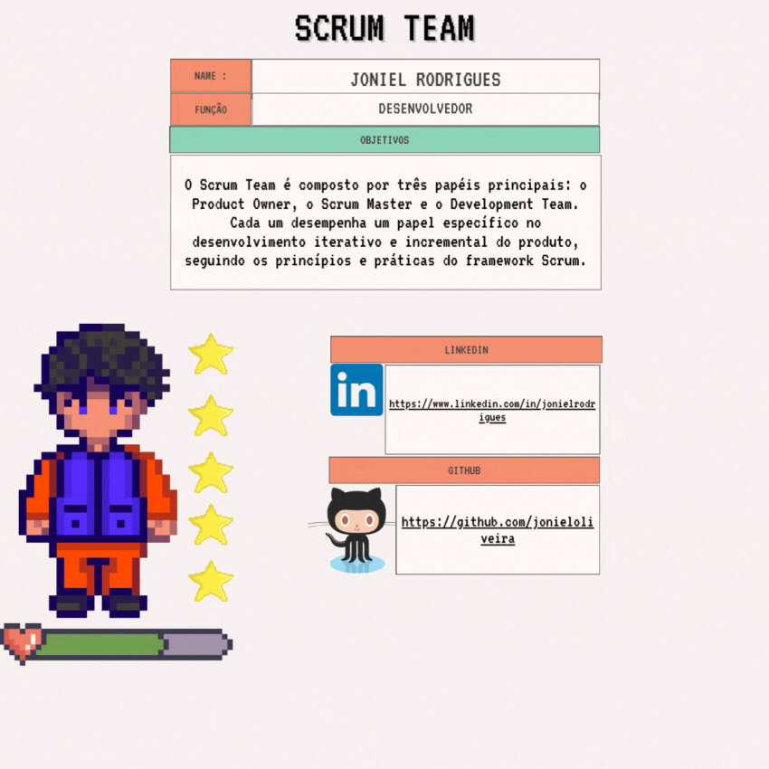

# **Scrum Learning Platform**

      

    <a href="#project-goal"> Project Goal </a> |
    <a href="#system-vision"> System Vision </a> |
    <a href="#methodology"> Methodology </a> |
    <a href="#mvp"> MVP </a> |
    <a href="#product-backlog"> Product Backlog </a> |
    <a href="#how-to-use-the-prototype"> How to use the Prototype </a> |
    <a href="#contributors"> Contributors </a>

# Scrum Learning Platform
Repository for the Integrated Project (API) of the Systems Analysis and Development (ADS) program.

# 🎯Project Goal
Build a website that works as a course, presenting and teaching all the processes and artifacts of the SCRUM methodology. Project status: In progress 🏇

# 💡System Vision
For a team that wants to learn and improve its knowledge of agile methodologies using Scrum.

#  👨🏿‍💻 Methodology
**Figma** was used to create the responsive prototype. The product backlog and process backlog were built using the knowledge and tools of the **Product Owner**, documented below. The final product uses **Python, HTML and CSS**. **Scrum** was used as the agile methodology to organize the team and the process.

# 🏆MVP

1. WireFrame: **(**[Clickable Prototype](https://encurtador.com.br/mnopM)**): Done**✅

# Product Backlog
| Item | Priority | ID | Description | Sprint|
| ---- | -------- | -- | ----------- | ----- |
| Backlog | 100 |#1| Delivery schedule according to the client's wishes and requirements. | **1** |
| Wireframe | 95 |#2| "As a client, I want to find Scrum applications on the wireframe page to align my team so it becomes self-organizing, communicative, collaborative and adaptable." | **1** |
| Initial Website - HTML | 90 |#3| "As a client, I want access to content about the Scrum agile method on the initial website so I can apply it in a standardized way with my team." | **2**|
| Initial Website - CSS | 85 |#4| "As a developer, I want to style the website pages with CSS to improve the design." | **2**|
| Initial Website - Flask | 80 |#5| "As a developer, I want to link the website pages with Flask to improve the program's responsiveness and standardize the header and footer." | **2** |
| Practical Scrum applications | 75 |#6| "As a client, I want to find practical examples on the website so the method can be applied to my employees in a standardized way." | **3** |
| Form creation | 70 |#7| "As a client, I want to access a form on the website for partial and final evaluations of the Scrum method, to improve the team's self-management and work on its weak points." | **3** |
| Website - Bootstrap | 65 |#8| "As a developer, I want to customize the page with Bootstrap and make it more responsive." | **3** |
| Testing | 60 |#9| Product testing to find and fix errors and bugs. | **4** |
| README | 55 |#10| Project documentation. | **4** |

# How to use the Prototype

# Demo video - MVP - Sprint 1:

[▶️ Sprint 1 demo (video)](docs/images/80f908cf.mp4)

# Demo video - MVP - Sprint 2:

[▶️ Sprint 2 demo (video)](docs/images/5238463d.mp4)

# Demo video - MVP - Sprint 3:

[▶️ Sprint 3 demo (video)](docs/images/ca9e12ad.mp4)

# Demo video - MVP - Sprint 4:

[▶️ Sprint 4 demo (video)](docs/images/eb4f7020.mp4)

# Contributors:
 |  

|  

 

   

  

  

  

