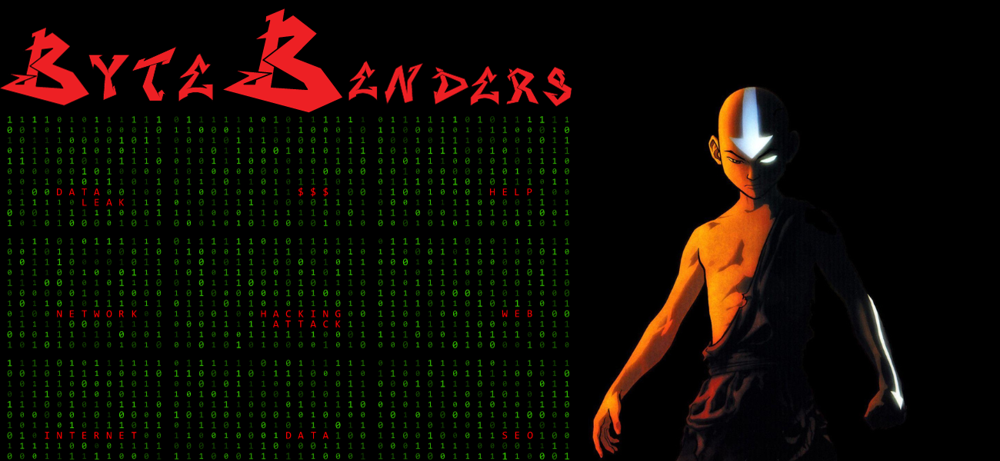

# **User-Standart**

      

    <a href="#objetivo-do-projeto"> Objetivo do Projeto </a> | 
    <a href="#visao-do-sistema"> Visão do Sistema </a> |
    <a href="#metodologia"> Metodologia </a> |  
    <a href="#mvp"> MVP </a> |
    <a href="#sprint-backlog"> Sprint Backlog </a> | 
    <a href="#product-backlog"> Product Backlog </a> | 
    <a href="#como-utilizar-o-prototipo"> Como utilizar o Protótipo </a> | 
     

# User-Standart
Repositório destinado ao grupo User-Standart, para desenvolvimento da API do primeiro semestre de ADS.

# 🎯Objetivo do Projeto
Desenvolver um site que sirva como um curso, indicando e ensinando todos os processos e artefatos da metodologia SCRUM. Status do projeto: Em andamento 🏇

# 💡Visão do Sistema
Para uma equipe que deseja aprender e aperfeiçoar seus conhecimentos em relação às metodologias ágeis utilizando o Scrum.

#  👨🏿‍💻 Metodologia 
A metodologia utilizada para a criação do protótipo responsivo foi o **Figma**, para o product backlog e o process backlog foi utilizado os conhecimentos e ferramentas do **Product Owner** que serão documentadas abaixo. Para o produto final, serão utilizadas as linguagens de programação **Python, HTML e CSS**. E para organização da equipe e do processo, foi utilizado como metodologias ágeis o **Scrum**.

# 🏆MVP

1. WireFrame: **(**[Protótipo Navegável](https://encurtador.com.br/mnopM)**): Concluído**✅

# Product Backlog
| Item | Prioridade | ID | Descrição | Sprint|
| ---- | ---------- | -- | --------- | ----- |
| Backlog | 100 |#1| Calendário de entregas de acordo com os desejos e requisitos do cliente. | **1** |
| Wireframe | 95 |#2| “Eu como cliente quero, na página wireframe, encontrar aplicações do Scrum para alinhar minha equipe para que seja auto-organizável, comunicativa, colaborativa e adaptável". | **1** |
| Criação do Site Inicial - html | 90 |#3| "Eu como cliente quero, no site inicial, ter acesso ao conteúdo sobre o método ágil Scrum para aplicá-lo de forma padronizada com a minha equipe". | **2**|
|Criação do Site Inicial - css | 85 |#4| "Eu como desenvolvedor quero, com css, estilizar as páginas do site para melhorar o desing". | **2**|
| Criação do Site Inicial - Flask | 80 |#5| "Eu como desenvolvedor quero, com Flask, linkar as páginas do site para melhorar a responsividade do programa e padronizar cabeçalho e rodapé". | **2** |
| Aplicações práticas do Scrum | 75 |#6| "Eu como cliente quero, encontrar no site, exemplos práticos para que o método seja aplicado para meus funcionários de forma padronizada". | **3** |
| Criação do formulário | 70 |#7| "Eu como cliente quero, acessar no site, um formulário para avaliações parciais e finais do método Scrum para melhorar o auto-gerenciamento da equipe e melhorar seus pontos fracos". | **3** |
| Site - Bootstrap | 65 |#8| "Eu como desenvolvedor quero, com Bootstrap, customizar a página e deixá-la mais responsiva". | **3** |
| Teste | 60 |#9| Teste do produto com intuito de encontrar e corrigir erros e bugs. | **4** |
| README | 55 |#10| Documentação do projeto. | **4** |

# Como utilizar o Protótipo 

# Vídeo de demonstração - MVP - Sprint 1:

https://github.com/Marianatebecherani/api-2sem-2023/assets/103541614/80f908cf-1d6b-48a7-9867-39217e96c9c9

# Vídeo de demonstração – MVP – Sprint 2:

https://github.com/Marianatebecherani/api-2sem-2023/assets/143021491/5238463d-8f71-49ba-8a52-c588f8c2dca6

# Vídeo de demonstração - MVP - Sprint 3:

https://github.com/Marianatebecherani/api-2sem-2023/assets/144804717/ca9e12ad-592b-48c8-9dd6-b04e4d6d1d1e

# Vídeo de demonstração - MVP - Sprint 4:

https://github.com/Marianatebecherani/api-2sem-2023/assets/143021491/eb4f7020-6b8b-48e0-bd88-751ca1ef16af

# Colaboradores:
 |  
 

|  

 

   

  

  

  

